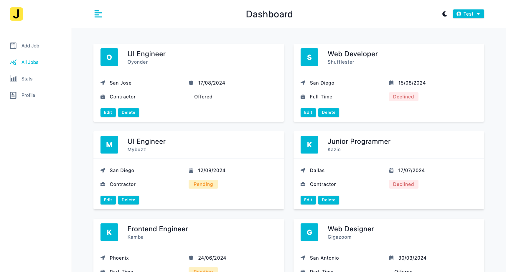
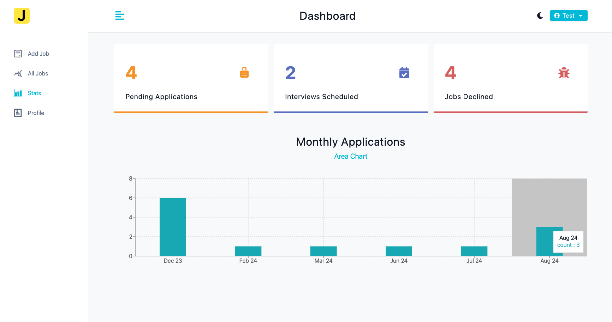

# A Job Application Tracking Web Application

JobTracker is a dynamic, single-page web application to streamline the tracking of job applications and elevate the management of users' job searches. The platform is crafted using a MERN technology stack that boasts React.js, Node.js (with Express.js), and MongoDB.

See Live demo [here](https://jobs-tracker-wjtf.onrender.com/).

Applications Management Dashboard

